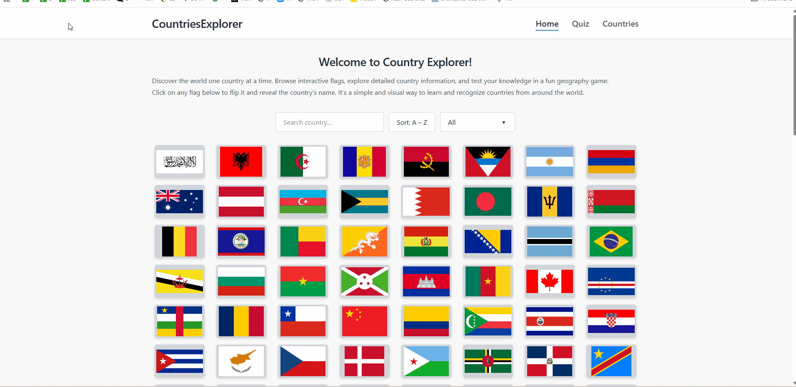

# 🌍 Country Explorer

[](https://world-explorer-phi.vercel.app/)
[](https://nextjs.org/)
[](https://www.typescriptlang.org/)
[](https://www.framer.com/motion/)



An interactive web application for exploring countries and testing your knowledge of world capitals.  
Built with Next.js, TypeScript, and Framer Motion to deliver smooth animations and an engaging learning experience.

## 🎯 Project Goals

This project was built as a frontend learning exercise to practice:

- Writing type-safe code with **TypeScript**
- Building interactive UI with **Next.js App Router**
- Creating smooth UI animations with **Framer Motion**

## 📸 Screenshots

### Home Page


### Interactive Flag Mosaic


### Countries Page


### Quiz Mode


### Quiz Completion


## ✨ Features

### 🏠 Home Page

- Animated welcome header with dynamic page title and description
- Interactive flag mosaic grid with smooth staggered animations
- Filter countries by continent
- Search countries by name in real-time
- Click any flag to reveal the country name

### 📋 Countries Page

- Comprehensive alphabetical list of all countries
- Quick filter by first letter (A-Z navigation)
- Clean table view with smooth transition animations
- Responsive design for all screen sizes

### 🎮 Quiz Mode

- **Customizable quizzes**: Select continent and number of questions
- **Multiple-choice format**: Guess the capital of each country
- **Progress tracking**: Visual progress bar shows quiz completion
- **Instant feedback**: See results with final score
- **Replay option**: Restart quiz anytime with different settings
- **Celebration effects**: Confetti animation on quiz completion

### 🎨 Animations

- Powered by **Framer Motion** for all transitions
- Staggered card animations when filtering or searching
- Smooth page transitions between routes
- Interactive hover states on all clickable elements

### ♿ Accessibility

- Semantic HTML structure throughout
- Proper ARIA labels for regions and interactive elements
- Screen reader-friendly titles and descriptions
- Keyboard navigation support

## 🚀 Tech Stack

- **Framework**: [Next.js 16](https://nextjs.org/)
- **Language**: [TypeScript 5](https://www.typescriptlang.org/)
- **Animation**: [Framer Motion 12](https://www.framer.com/motion/)
- **Data Fetching**: [SWR](https://swr.vercel.app/)
- **Validation**: [Zod](https://zod.dev/)
- **Styling**: CSS Modules
- **Confetti**: [canvas-confetti](https://github.com/catdad/canvas-confetti)
- **Fonts**: [Fontshare](https://www.fontshare.com/) — *Synonym (400), Amulya (700)*

## 📦 Installation

1. **Clone the repository**

```bash
git clone https://github.com/yourusername/country-explorer.git
cd country-explorer
```

2. **Install dependencies**

```bash
npm install
```

3. **Run the development server**

```bash
npm run dev
```

4. **Open the app**

Visit **http://localhost:3000** in your browser.

---

## 🛠️ Available Scripts

* **npm run dev** – Start development server
* **npm run build** – Build for production
* **npm run start** – Start production server
* **npm run lint** – Run ESLint
* **npm run format** – Format code with Prettier

---

## 🌐 Live Demo

Check out the live application:
https://world-explorer-phi.vercel.app/

---

## 📝 License

This project is open source and available under the **MIT License**.

---

## 🙏 Acknowledgments

* Country data provided by **[REST Countries API](https://restcountries.com/)**
* Icons and design inspiration from the open source community
* The tab icon was generated with ChatGPT
* Built with **Next.js** and deployed on **Vercel**

---

## 📧 Contact

Polina – [polinasmekhova@gmail.com](mailto:polinasmekhova@gmail.com)

Project Link:
https://github.com/polina2410/world-explorer
