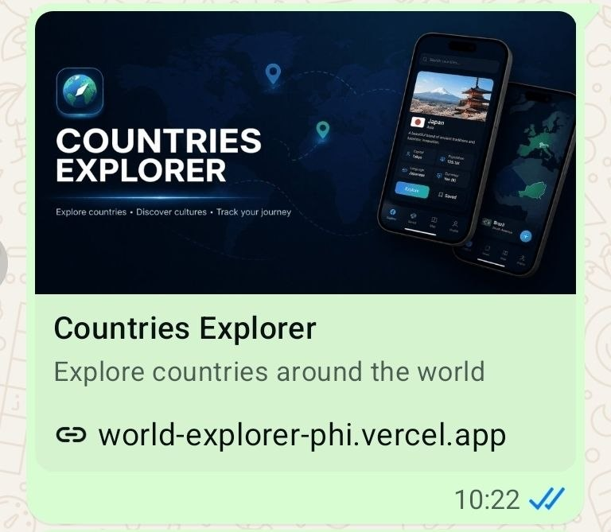

# Country Explorer

[](https://world-explorer-phi.vercel.app/)

[](https://nextjs.org/)
[](https://www.typescriptlang.org/)
[](https://motion.dev/)


An interactive web application for exploring countries and testing your knowledge of world capitals.
Built with Next.js, TypeScript, and Motion to deliver smooth animations and an engaging learning experience.

## Features

- **Home** - flag mosaic grid with continent filter and real-time search
- **Countries** - alphabetical list with A–Z filter, population sort, flag zoom, and map links
- **Quiz** - customizable capital-guessing quiz with progress tracking, scoring, and confetti
- **Feedback** - modal form saved to Supabase with rate limiting via Upstash Redis
- **Theming** - light/dark mode persisted across sessions
- **Accessibility** - semantic HTML, ARIA labels, keyboard navigation throughout

## Tech Stack

- **Framework**: [Next.js 16](https://nextjs.org/)
- **Language**: [TypeScript 5](https://www.typescriptlang.org/)
- **Animation**: [Motion 12](https://motion.dev/)
- **Validation**: [Zod](https://zod.dev/)
- **Testing**: [Vitest](https://vitest.dev/) + [Testing Library](https://testing-library.com/)
- **Styling**: CSS Modules
- **Database**: [Supabase](https://supabase.com/)
- **Rate limiting**: [Upstash Redis](https://upstash.com/)
- **Confetti**: [canvas-confetti](https://github.com/catdad/canvas-confetti)
- **Fonts**: [Fontshare](https://www.fontshare.com/) - *Synonym (400), Amulya (700)*

## Installation

1. **Clone the repository**

```bash
git clone https://github.com/polina2410/world-explorer.git
cd world-explorer
```

2. **Install dependencies**

```bash
npm install
```

3. **Set up environment variables**

Copy `.env.example` to `.env.local` and fill in your values:

```env
SUPABASE_URL=your-project-url
SUPABASE_SERVICE_ROLE_KEY=your-service-role-key

UPSTASH_REDIS_REST_URL=your-upstash-redis-url
UPSTASH_REDIS_REST_TOKEN=your-upstash-redis-token

NEXT_PUBLIC_APP_URL=https://your-domain.com
```

Get Supabase values from your project under **Settings → API**.
Get Upstash values from your [Upstash Console](https://console.upstash.com/) after creating a Redis database - find them
under **REST API**.
Set `NEXT_PUBLIC_APP_URL` to your production domain for correct Open Graph URLs (defaults to `http://localhost:3000` in
development).

Then create the `feedback` table in your Supabase SQL editor:

```sql
create table feedback
(
    id         uuid primary key default gen_random_uuid(),
    name       text,
    email      text not null,
    message    text not null,
    created_at timestamptz      default now()
);
```

4. **Run the development server**

```bash
npm run dev
```

5. Open [http://localhost:3000](http://localhost:3000) in your browser.

---

## Logging

Structured logging via `src/lib/logger.ts`:

- **Development**: colored console output
- **Production**: JSON per line, visible in Vercel's free function logs (Project → Logs)

Logged events: countries fetch, API route errors, feedback submissions, and rate limit blocks.

## Open Graph Image

To enable rich link previews on social media, add an `og-image-default.png` (1200×630px) to the `/public` directory.



---

## License

MIT

---

## Acknowledgments

- Country data provided by [REST Countries API](https://restcountries.com/)
- Tab icon and OG image generated with ChatGPT
- Built with Next.js and deployed on Vercel

---

## Contact

Polina - [polinasmekhova@gmail.com](mailto:polinasmekhova@gmail.com)